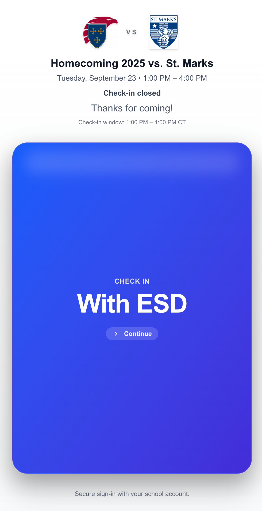
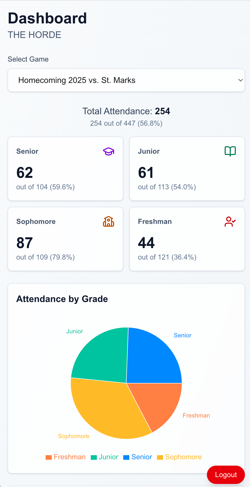

# The Horde Attendance System

Track student attendance at school games and fuel grade-level competition. A secure, mobile-first platform that makes checking in fast and fair.

## 🎯 Student Check-In

Quick and secure attendance tracking

### How it works:
1. **Scan QR Code** - Arrive at the game venue and scan the provided QR code
2. **Sign In with School** - Secure OAuth authentication using your school credentials
3. **You're Checked In!** - Your attendance is recorded and contributes to your grade's score

## 📊 Admin Dashboard

Real-time attendance analytics

### Features:
- **📈 Live Leaderboard** - Track attendance counts by grade level in real-time
- **📊 Visual Analytics** - Charts and graphs showing attendance trends and statistics
- **🔒 Secure Access** - Password-protected route for organizers only

## Why Attendance Matters

This system powers a grade-level competition that increases student engagement and school spirit.

### 🏆 Fair Competition
Secure authentication ensures only legitimate students can check in, making the competition fair and verifiable.

### ⚡ Lightning Fast
Mobile-first design with minimal steps means students can check in quickly without disrupting the game experience.

### 🔒 Secure & Private
Industry-standard OAuth authentication protects student privacy while ensuring data integrity.

---

Built with Next.js, TypeScript, Tailwind CSS, and Supabase.